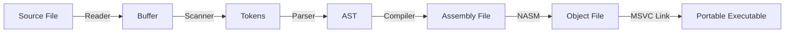

# cx

cx is a small programming language written in C (my first time!). It contains a scanner, parser, printer and Windows x64 code generator. Currently, it only supports small programs as it uses fixed-size arrays of 100 items for almost everything, for simplicity reasons.



## Quick Start

To use cx, you will need to:
1. Compile the program into assembly by running `cx <cx_input_file> <asm_output_file>`.

You can use the sample files in the `samples/` directory for testing if you wish.

Afterwards, you can optionally assemble the assembly files into portable executable format using NASM and MSVC link, like so:
1. Assemble the program by running `nasm -f win64 <asm_output_file> -o <obj_output_file>`.
2. Link necessary libraries by running `link <obj_output_file> /entry:main /subsystem:console /out:<exe_output_file> kernel32.lib msvcrt.lib ucrt.lib legacy_stdio_definitions.lib`.

## Knowledge Base

### Grammar

```ebnf
program = { declaration }, EOF;

declaration = decl_var | statement;
decl_var = "var", IDENTIFIER, [ "=", expression ], ";";

statement = stmt_expr | stmt_cond | stmt_loop | stmt_print | block;
block = "{", { declaration }, "}";
stmt_expr = expression, ";";
stmt_print = "print", expression, ";";
stmt_cond = "if", "(", expression, ")", statement, [ "else", statement ];
stmt_loop = "while", "(", expression, ")", statement;

expression = equality;
equality = comparison, { ("!=" | "=="), comparison };
comparison = term, { (">" | ">=" | "<" | "<="), term };
term = factor, { ("-" | "+"), factor };
factor = unary, { ("/" | "*"), unary };
unary = ("!" | "-"), unary | primary;
primary = NUMBER | STRING | "true" | "false" | "nil" | IDENTIFIER | "(", expression, ")";
```

#### Comments

Comments are marked with two slashes (`//`).

```javascript
print 1; // Hello!
```

#### Print

`print` is the only implementation of IO in cx. It can be used to display the results of operations.
```javascript
print "Hello World!";
```

#### Unary operators

Unary operators manipulate a single operand.
| Symbol | Operation |
|---|---|
|!|Logical negation|
|-|Arithmetic negation|

```javascript
print !true;
print -1;
```

#### Arithmetic operators

Arithmetic operators can be used to manipulate values.
| Symbol | Operation |
|---|---|
|+|Addition|
|-|Subtraction|
|*|Multiplication|
|/|Division|
|%|Modulo|

```javascript
print 1 + 2 - 3 * 4 / 5 % 6;
```

#### Comparison operators

Comparison operators can be used to compare two values and evaluate to booleans. 
| Symbol | Operation |
|---|---|
|==|Equal to|
|!=|Not equal to|
|>|Greater than|
|>=|Greater than or equal to|
|<|Lesser than|
|<=|Lesser than or equal to|

```javascript
var x = 1;
var y = 1;

if (x == y) print true;
if (x != y) print true;
if (x > y) print true;
if (x < y) print true;
if (x >= y) print true;
if (x < y) print true;
if (x <= y) print true;
```

#### Variables

Variables can be used for storing the results of operations, allowing for more complex programs. The contents of variables can be changed after initialization via assignment. Variable names can be composed of alphanumeric characters, except for the first letter, which must always be a letter.

```javascript
var x = 1;
print x;
```
```javascript
var x = 1;
x = 2;
print x;
```

#### Blocks

Blocks can be used to enter a new scope, allowing for variables to be redefined. They are commonly used in conjunction with conditional statements and loop statements as they allow for multiple statements.
```javascript
var x = 1;

while (x < 10) {
    x = x + 1;
    print x;
}
```

#### Conditional Statements

Conditional statements can be used 
```javascript
var x = 1;
if (x > 1) x = 2;
print x;
```
```javascript
var x = 1;
var y = 2;

if (x > y) { 
    x = 2;
    y = 3;
}

print x + y;
```
```javascript
var x = 1;
if (x > 2) {
    x = x - 1;
} else {
    print x;
}
```

#### Loop Statements

Loop statements can be used to repeat a given operation until a condition is no longer met.
```javascript
var x = 1;
while (x < 10) x = x + 1;
```
```javascript
var x = 1;
while (x < 10) {
    x = x + 1;
    print x;
}
```

## Images


